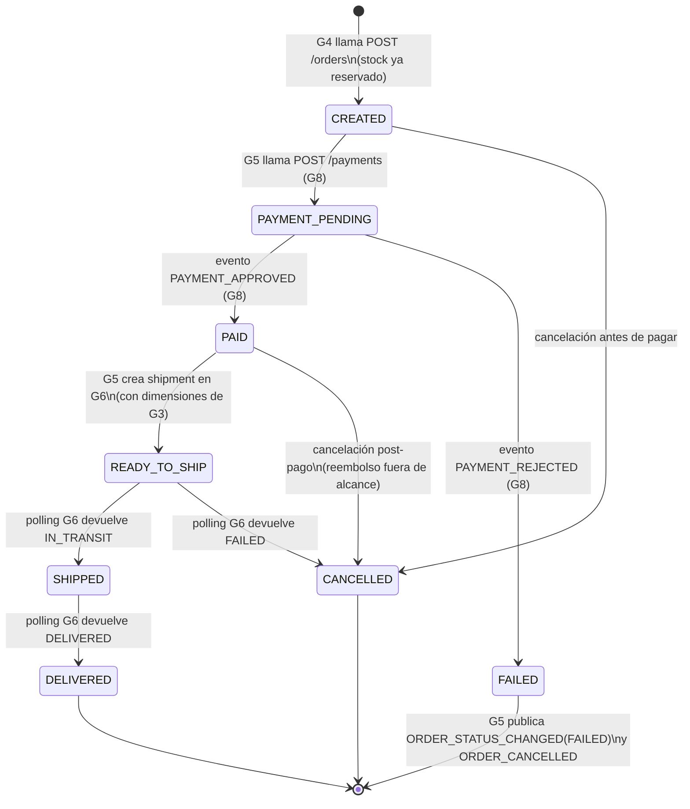

# Documento de Arquitectura — Grupo 5: Pedidos (Order Management)

**Proyecto:** Mini Marketplace Cloud — INFE6001-411-TEORIA-2026-1
**Servicio:** `order-service`
**Versión:** 1.1.0 (alineada con auditoría de contratos cruzados G3, G4, G6 y G8)

> ⚠️ **Nota sobre numeración de grupos:** el enunciado del curso numera
> "Grupo 6 = Inventario" y "Grupo 7 = Despacho" como equipos separados. En
> la organización real de GitHub (`Mini-Marketplace-Cloud-UTEM`), **Grupo 4
> absorbió Carrito + Checkout + Inventario**, **Grupo 6 = Despacho**,
> **Grupo 7 = Reportería**, **Grupo 8 = Pagos + Notificaciones**. Este
> documento usa la numeración **real** del repo. Donde difiera con el
> enunciado, se indica.

---

## 1. Responsabilidad

Crear y administrar el ciclo de vida de un pedido desde que el checkout se
confirma hasta que se entrega o se cancela. Es el núcleo transaccional del
sistema y el servicio de mayor impacto si cambia su contrato sin avisar.

**Decisión v1.1:** G5 asume la responsabilidad de iniciar la transacción
monetaria, invocando `POST /v1/payments` de G8 inmediatamente después de
persistir la orden en estado `CREATED`. Esto resuelve el gap de "orquestación
huérfana" detectado en la revisión de contratos cruzados.

No valida stock — eso ya ocurrió en G4 antes de llamar a `POST /orders`.

---

## 2. Dueño del dato

`Order` y `OrderItem`. Nadie más escribe directamente sobre estas tablas.
Los datos monetarios se almacenan exclusivamente como enteros en CLP.

---

## 3. Posición en el ecosistema (flujo real sincronizado)

```
Frontend (G1) ──► BFF (G1) ──► Checkout (G4)
                                   │
                       1. valida stock, reserva inventario
                       2. POST /orders  (crea el pedido en G5,
                          stock ya reservado, montos en CLP/integer)
                                   │
                                   ▼
                          order-service (G5)  status = CREATED
                                   │
                       3. G5 inicia pago → POST /v1/payments (G8)
                          status = PAYMENT_PENDING
                                   │
                    4. G8 publica PAYMENT_APPROVED / PAYMENT_REJECTED
                                   │
                                   ▼
                          G5 consume el evento
                          status = PAID  (o FAILED + ORDER_CANCELLED si rechazado)
                                   │
                       5. G5 consulta dimensiones → GET /products/{id} (G3)
                          (requerido por G6 para calcular paquete)
                                   │
                       6. G5 crea envío → POST /api/v1/shipments (G6)
                          status = READY_TO_SHIP
                                   │
                       7. Polling periódico → GET /shipments?orderId= (G6)
                          status = SHIPPED (cuando IN_TRANSIT)
                          status = DELIVERED (cuando DELIVERED)
                                   │
                       8. G5 publica ORDER_CREATED / ORDER_STATUS_CHANGED /
                          ORDER_CANCELLED → G7 (Reportería) y G8 (Notif.)
```

---

## 4. Modelo de datos

```
Order
 ├─ orderId          string    PK negocio, formato ORD-YYYYMMDD-NNN
 ├─ userId           uuid      FK lógica a G2 (Auth)
 ├─ status           enum      ver §5
 ├─ items[]          OrderItem[]
 ├─ shippingAddress  object?   nullable — G4 no lo captura aún (ver §9, gap 3)
 ├─ subtotal         integer   CLP, sin decimales
 ├─ shippingCost     integer   CLP
 ├─ totalAmount      integer   CLP
 ├─ currency         enum      [CLP]
 ├─ idempotencyKey   uuid      deduplicación de creación (no se expone en GET)
 ├─ notes            string?
 └─ createdAt / updatedAt      date-time UTC

OrderItem  (embebido en Order, no tabla propia expuesta)
 ├─ productId   uuid     FK lógica a G3 (Catálogo)
 ├─ name        string   snapshot al momento de compra
 ├─ quantity    integer
 ├─ unitPrice   integer  CLP
 └─ subtotal    integer  CLP
```

**Por qué `name` y `unitPrice` son snapshots:** si G3 cambia precio o nombre
después de la compra, el pedido histórico no debe cambiar retroactivamente.
G4 resuelve esos valores contra G3 al momento del checkout y los entrega ya
resueltos en el `POST /orders`.

---

## 5. Máquina de estados



> **Nota sobre `STOCK_RESERVED`:** este estado existe en el enum por
> compatibilidad con la tabla de mapeo acordada con el BFF
> (`canonical-models.md`), pero en la práctica el stock ya está reservado por
> G4 antes de que el pedido exista en G5 — no es una transición que este
> servicio dispare. Se considera implícito en `CREATED`. Documentado como
> deuda técnica pendiente de limpiar con G1.

Transiciones no listadas se rechazan con `409 INVALID_STATUS_TRANSITION`.

---

## 6. Contratos que expone

Ver `contrato/openapi.yaml` (REST) y `contrato/events.md` (eventos Pub/Sub).

| Tipo | Contrato |
|---|---|
| `POST /orders` | Crear pedido — llamado por G4 |
| `GET /orders/{orderId}` | Detalle de un pedido |
| `PATCH /orders/{orderId}/status` | Transición de estado (uso interno) |
| `GET /users/{userId}/orders` | Listado paginado — consumido por G1 (BFF) |
| Publica `ORDER_CREATED` | Al registrar la orden exitosamente |
| Publica `ORDER_STATUS_CHANGED` | En cada transición de estado (incluye FAILED) |
| Publica `ORDER_CANCELLED` | Por fallo de pago o despacho |
| Consume `PAYMENT_APPROVED` / `PAYMENT_REJECTED` / `PAYMENT_PENDING` | De G8 |

---

## 7. Seguridad y trazabilidad

- Todo endpoint recibe `Authorization: Bearer <token>`.
- Antes de procesar, G5 valida el token contra `POST /auth/validate` de G2
  (estándar centralizado, ver `data-dictionary/estandar-jwt.md`). No se
  verifica firma JWT localmente.
- `GET /users/{userId}/orders`: el `userId` del path debe coincidir con el
  `user.id` devuelto por `/auth/validate`, salvo rol `admin` u `operador logístico`.
- Las llamadas salientes hacia G6 inyectan obligatoriamente:
  `X-Request-Id` (UUID nuevo por llamada), `X-Correlation-Id` (del pedido) y
  `X-Consumer: G5-Pedidos`.

---

## 8. Idempotencia

`POST /orders` requiere el header `Idempotency-Key: <uuid>` (regla global del
proyecto). Si la misma clave llega dos veces:

- Mismo body → responde `200` con el pedido ya creado (sin duplicar).
- Body distinto → `409 DUPLICATED_ORDER`.

G5 es la segunda línea de defensa: en la integración real, G4 ya absorbe el
doble clic en su propio `POST /v1/checkout`. También se aplica idempotencia
al consumo de eventos: si el mismo `eventId` de G8 llega dos veces, G5 ignora
la segunda entrega (`UNIQUE constraint` sobre `eventId` procesado).

---

## 9. Gaps de integración (estado actual)

1. **G6 sin worker de Outbox (bloqueante temporal):** G6 no tiene un proceso
   activo que despache `outbox_events` a un broker real. G5 usa polling
   periódico (`GET /api/v1/shipments?orderId=`) como mitigación. Se migra a
   evento real cuando G6 active el worker — documentar ese cambio como
   `events.md v1.1`. Responsable: coordinador G5 + G6.

2. **Incompatibilidad monetaria con G4 (bloqueante crítico):** G4 envía
   montos en USD/float. El contrato de G5 rechaza estrictamente cualquier
   `currency` distinto a `CLP` y montos con decimales. Requiere mesa de diseño
   con G4 para corregir `contrato-g4.yaml` antes de E3.

3. **`shippingAddress` ausente en Checkout (deuda técnica):** G4 no propaga
   el objeto `shippingAddress`. G5 lo acepta como `nullable` y delega al BFF
   (G1) la resolución desde el perfil de G2. Documentado como issue en el
   repositorio de G4; resolver antes de E3.

4. **`registro-de-servicios.md` pendiente (bloqueante operacional para E3):**
   La fila de G5 en `marketplace-contracts/registro-de-servicios.md` dice
   `_pendiente_`. Sin URL publicada, G4 y G6 no saben a qué endpoint apuntar
   en el ambiente cloud. Actualizar al desplegar en Render.

---

## 10. Stack recomendado

- **Python 3.12 + FastAPI** — consistente con G6 y G1 (BFF).
- **Pydantic v2** con `alias_generator` camelCase — evita traducción manual
  snake_case → camelCase en cada endpoint.
- **PostgreSQL** (Render Free o Supabase) vía SQLAlchemy — coherente con el
  requisito de SQL evaluado para este grupo.
- **Docker** — obligatorio por `conventions.md` (sección Despliegue). El
  `Dockerfile` de G6-Shipment-Service puede usarse como punto de partida.

---

## 11. Despliegue

- Cloud: Render Free (API) + Render PostgreSQL Free, o Supabase/Neon.
- Al desplegar, actualizar la fila de G5 en
  `marketplace-contracts/registro-de-servicios.md` — sin eso, ningún otro
  grupo sabe a qué URL llamar (ver §9, gap 4).
